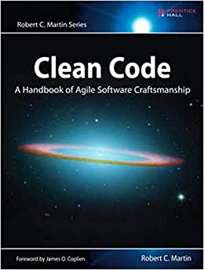

###### 

O renomado especialista em software, Robert C. Martin, apresenta um paradigma 
revolucionário com Código limpo: Habilidades Práticas do Agile Software. 
Martin se reuniu com seus colegas do Mentor Object para destilar suas melhores 
e mais ágeis práticas de limpar códigos “dinamicamente” em um livro que introduzirá 
gradualmente dentro de você os valores da habilidade de um profissional de softwares 
e lhe tornar um programador melhor –mas só se você praticar.

Que tipo de trabalho você fará? Você lerá códigos aqui, muitos códigos. 
E você deverá descobrir o que está correto e errado nos códigos. 
E, o mais importante, você terá de reavaliar seus valores profissionais 
e seu comprometimento com o seu ofício.

Código limpo está divido em três partes. Na primeira há diversos capítulos que descrevem 
os princípios, padrões e práticas para criar um código limpo.

A segunda parte consiste em diversos casos de estudo de complexidade cada vez maior.
Cada um é um exercício para limpar um código – transformar o código base que 
possui alguns problemas em um melhor e eficiente. 
A terceira parte é a compensação: um único capítulo com uma lista de heurísticas e “odores” 
reunidos durante a criação dos estudos de caso. O resultado será um conhecimento base 
que descreve a forma como pensamos quando criamos, lemos e limpamos um código.

#### CONTEÚDO

- Como distinguir um código bom de um ruim
- Como escrever códigos bons e como transformar um ruim em um bom
- Como criar bons nomes, boas funções, bons objetos e boas classes
- Como formatar o código para ter uma legibilidade máxima
- Como implementar completamente o tratamento de erro sem obscurecer a lógica
- Como aplicar testes de unidade e praticar o desenvolvimento dirigido a testes
