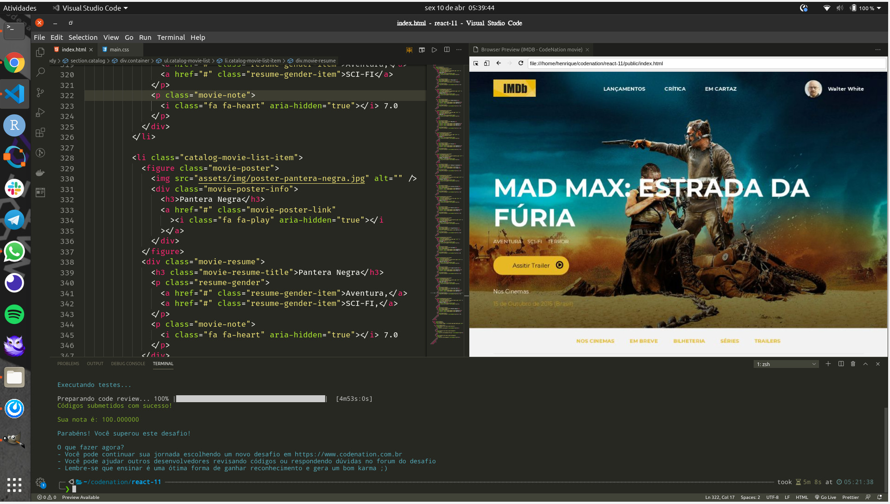

Nesta primeira semana tivemos como desafio na aceleração em React da [CODENATION](https://codenation.dev/),
criar uma Web page utilizando HTML/CSS apenas.




Consegui um resultado satisfatório ;-)!


Neste post vou mostrar como podemos fazer isso utilizando React, tirando proveito do
seu poderoso modelo composicional de componentização.

##### Vamos ao Desafio

Para isso temos Layout Design UI como Guia para nosso desenvolvimento, 
vamos então ao nosso planejamento.

<hr />

## Fatiar Componentes


### index.tsx

> Inicialmente podemos dividir nossa UI em 3 grandes escopos:

- ##### header.tsx
- ##### content.tsx
- ##### footer.tsx

<hr />


### header.tsx

> Podemos dvidir o Header em 2 escopos internos:

- ##### navbar.tsx
    - ##### logo.tsx, 
    - ##### nav-links.tsx, 
    - ##### user-badge.tsx


- ##### header-content.tsx 
    - ##### movie-title.tsx,
    - ##### movie-genders.tsx,
    - ##### movie-trailer-button.tsx,
    - ##### movie-information.tsx


> Pronto agora basta replicar a forma de pensar ao **content.tsx** e ao **footer.tsx**.

<hr />

## Fluxo de Tarefas

| Task   |      Commit     | 
|----------|:-------------:|
| Initialize project using Create React App | 744167b |
| feat: create **logo** component | eff910f |
| feat: create **nav-links** component | 9ccf9d8 |
| feat: create **user-badge** component | - |
| feat: create **navbar** component | - |
| feat: create **header-contant** component | - |
| feat: create **header** component  | - |


#### Criando o Projeto
<br />

```bash noLineNumbers

create-react-app imdb-static-page --template typescript

Creating a new React app in /home/henrique/codenation/imdb-static-page.

Installing packages. This might take a couple of minutes.
Installing react, react-dom, and react-scripts with cra-template-typescript...

yarn add v1.21.1
[1/4] Resolving packages...
[2/4] Fetching packages...
info fsevents@1.2.12: The platform "linux" is incompatible with this module.
info "fsevents@1.2.12" is an optional dependency and failed compatibility check. Excluding it from installation.
info fsevents@2.1.2: The platform "linux" is incompatible with this module.
info "fsevents@2.1.2" is an optional dependency and failed compatibility check. Excluding it from installation.
[3/4] Linking dependencies...
warning "react-scripts > @typescript-eslint/eslint-plugin > tsutils@3.17.1" has unmet peer dependency "typescript@>=2.8.0 || >= 3.2.0-dev || >= 3.3.0-dev || >= 3.4.0-dev || >= 3.5.0-dev || >= 3.6.0-dev || >= 3.6.0-beta || >= 3.7.0-dev || >= 3.7.0-beta".
[4/4] Building fresh packages...
success Saved lockfile.
success Saved 13 new dependencies.
info Direct dependencies
├─ cra-template-typescript@1.0.3
├─ react-dom@16.13.1
├─ react-scripts@3.4.1
└─ react@16.13.1
info All dependencies
├─ @babel/plugin-transform-flow-strip-types@7.9.0
├─ @babel/plugin-transform-runtime@7.9.0
├─ @babel/plugin-transform-typescript@7.9.4
├─ @babel/preset-typescript@7.9.0
├─ babel-preset-react-app@9.1.2
├─ cra-template-typescript@1.0.3
├─ eslint-config-react-app@5.2.1
├─ react-dev-utils@10.2.1
├─ react-dom@16.13.1
├─ react-error-overlay@6.0.7
├─ react-scripts@3.4.1
├─ react@16.13.1
└─ scheduler@0.19.1
Done in 131.91s.

Initialized a git repository.

Installing template dependencies using yarnpkg...
yarn add v1.21.1
[1/4] Resolving packages...
[2/4] Fetching packages...
info fsevents@2.1.2: The platform "linux" is incompatible with this module.
info "fsevents@2.1.2" is an optional dependency and failed compatibility check. Excluding it from installation.
info fsevents@1.2.12: The platform "linux" is incompatible with this module.
info "fsevents@1.2.12" is an optional dependency and failed compatibility check. Excluding it from installation.
[3/4] Linking dependencies...
warning " > @testing-library/user-event@7.2.1" has unmet peer dependency "@testing-library/dom@>=5".
[4/4] Building fresh packages...
success Saved lockfile.
success Saved 23 new dependencies.
info Direct dependencies
├─ @testing-library/jest-dom@4.2.4
├─ @testing-library/react@9.5.0
├─ @testing-library/user-event@7.2.1
├─ @types/jest@24.9.1
├─ @types/node@12.12.35
├─ @types/react-dom@16.9.6
├─ @types/react@16.9.34
├─ react-dom@16.13.1
├─ react@16.13.1
└─ typescript@3.7.5
info All dependencies
├─ @babel/runtime-corejs3@7.9.2
├─ @sheerun/mutationobserver-shim@0.3.3
├─ @testing-library/dom@6.16.0
├─ @testing-library/jest-dom@4.2.4
├─ @testing-library/react@9.5.0
├─ @testing-library/user-event@7.2.1
├─ @types/jest@24.9.1
├─ @types/node@12.12.35
├─ @types/prop-types@15.7.3
├─ @types/react-dom@16.9.6
├─ @types/react@16.9.34
├─ @types/testing-library__dom@7.0.1
├─ @types/testing-library__react@9.1.3
├─ css.escape@1.5.1
├─ csstype@2.6.10
├─ dom-accessibility-api@0.3.0
├─ min-indent@1.0.0
├─ react-dom@16.13.1
├─ react@16.13.1
├─ redent@3.0.0
├─ strip-indent@3.0.0
├─ typescript@3.7.5
└─ wait-for-expect@3.0.2
Done in 40.94s.

We detected TypeScript in your project (src/App.test.tsx) and created a tsconfig.json file for you.

Your tsconfig.json has been populated with default values.

Removing template package using yarnpkg...

yarn remove v1.21.1
[1/2] Removing module cra-template-typescript...
[2/2] Regenerating lockfile and installing missing dependencies...
info fsevents@2.1.2: The platform "linux" is incompatible with this module.
info "fsevents@2.1.2" is an optional dependency and failed compatibility check. Excluding it from installation.
info fsevents@1.2.12: The platform "linux" is incompatible with this module.
info "fsevents@1.2.12" is an optional dependency and failed compatibility check. Excluding it from installation.
warning " > @testing-library/user-event@7.2.1" has unmet peer dependency "@testing-library/dom@>=5".
success Uninstalled packages.
Done in 6.70s.

Created git commit.

Success! Created imdb-static-page at /home/henrique/codenation/imdb-static-page
Inside that directory, you can run several commands:

  yarn start
    Starts the development server.

  yarn build
    Bundles the app into static files for production.

  yarn test
    Starts the test runner.

  yarn eject
    Removes this tool and copies build dependencies, configuration files
    and scripts into the app directory. If you do this, you can’t go back!

We suggest that you begin by typing:

  cd imdb-static-page
  yarn start

Happy hacking!

```
> Vamos criar a logo > navbar >  header.

```tsx:title='src/header/logo.tsx'

import React from 'react'

type LogoProps = {
  data: {
    logo: {
      title: string
      img: string
    }
  }
}

const Logo = ({ data: { logo }}: LogoProps) => {
  return (
    <a href='/'>
      
    </a>
  )
}

export default Logo

```

```bash:title=COMMIT

git commit -m "feat: create logo component" --amend
[master eff910f] feat: create logo component
 Date: Fri Apr 10 23:56:56 2020 -0300
 4 files changed, 407 insertions(+), 6 deletions(-)
 create mode 100644 .editorconfig
 create mode 100644 src/header/logo.tsx

```

> Vamos criar a nav-links > navbar >  header.

```tsx:title='src/header/nav-links.tsx'

import React from 'react'

type NavLinksProps = {
  data: {
    links: {
      title: string
      link: string
    }[]
  }
}

const NavLinks = ({ data: { links }}: NavLinksProps) => {
  return (
    <ul>
      {links.map(({ title, link }, index) => (
        <li key={ index } >
          <a href={ link } >{ title }</a>
        </li>
      ))}
    </ul>
  )
}

export default NavLinks

```

```bash:title=COMMIT

git commit -m "feat: create nav-links component"
[master 9ccf9d8] feat: create nav-links component
 1 file changed, 25 insertions(+)
 create mode 100644 src/header/nav-links.tsx

``` 
> Vamos criar a user-badge > navbar >  header.

```tsx:title=title='src/header/user-badge.tsx'

import React from 'react'

type UserBadgeProps = {
  data: {
    user: {
      name: string
      avatar: string
    }
  }
}

const UserBadge = ({ data: { user }}: UserBadgeProps) => {
  return (
    <section>
      
      <p>{ user.name }</p>
    </section>
  )
}

export default UserBadge

```

```bash:title=COMMIT

git commit -m "feat: create user-badge component"
[master 454a8e5] feat: create user-badge component
 3 files changed, 25 insertions(+), 4 deletions(-)
 create mode 100644 src/header/user-badge.tsx

```