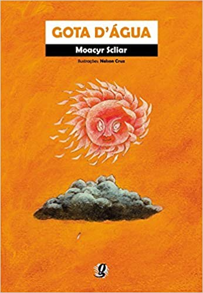

###### 

Esse conto de Moacyr Scliar narra a história de uma gota d'água e o 
seu encontro com um menino, Toninho Miúdo. Filho mais velho de uma família numerosa,
morava em uma região muito seca muito seca. Faltava água para as plantas, faltava água 
para os animais, faltava água até para as pessoas. (...) Uma vez, como sempre fazia, o 
menino saiu com a esperança de ainda encontrar um pouco d'água em uma pequena fonte perto de casa.
A fonte havia secado. Porém, ele viu, no meio das pedras, uma gota d'água que rapidamente desapareceu
na areia. Ela também viu Toninho e teve tempo de ouvi-lo dizer que ela era a coisa mais linda que ele já
tinha visto. A gota seguiu seu curso, rumo ao mar, sempre se lembrando do menino pobre. O menino ficou, 
na rudeza da terra árida, sempre se lembrando da beleza da gota. Porém, o encontro entre eles não foi em vão.
Um dia, a gota pôde transformar-se em chuva e cair sobre a terra seca onde morava Toninho.

> E ai vamos fazer chover?

  

#### PROJETO

##### 1 - INCEPTION

- Descrever a visão do produto
- Priorizar os objetivos de negócio
- Descrever os usuários, seus perfis e necessidades que impulsionam a funcionalidade do produto.
- Entender o escopo funcional de alto nível
- Detalhar percepções de risco, esforço e valor de negócio por área funcional.
- Descrever as principais jornadas de usuários
- Definir um roteiro de lançamento incremental, mostrando claramente os incrementos de MVP.
- Estimar esforço por amostragem
- Calcular custos e especificar datas e cronograma de entrega

#### Workshop de Lean Inception

| Dia   |      Tema      |  Status |
|----------|:-------------:|------:|
| à definir | Pré Inception(O que é? Para quem?) | - |
| à definir | Introdução / Kick-off / Visão do Produto  | - |
| à definir | Objetivos do Produto | - |
| à definir | Personas | - |
| à definir | Trade-offs | - |
| à definir | Funcionalidades | - |
| à definir | Nivelamento das Funcionalidades | - |
| à definir | Jornadas do usuário | - |
| à definir | Sequenciamento de Funcionalidades | - |
| à definir | Canvas MVP | - |
| à definir | Showcase | - |

#### Sala de Guerra

[https://gotasdagua.workplace.com/](https://gotasdagua.workplace.com/)